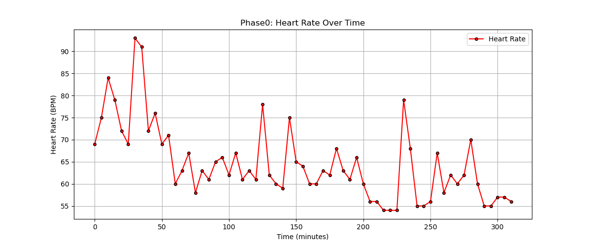
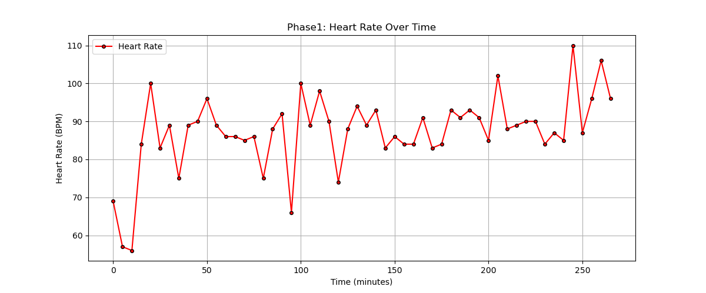
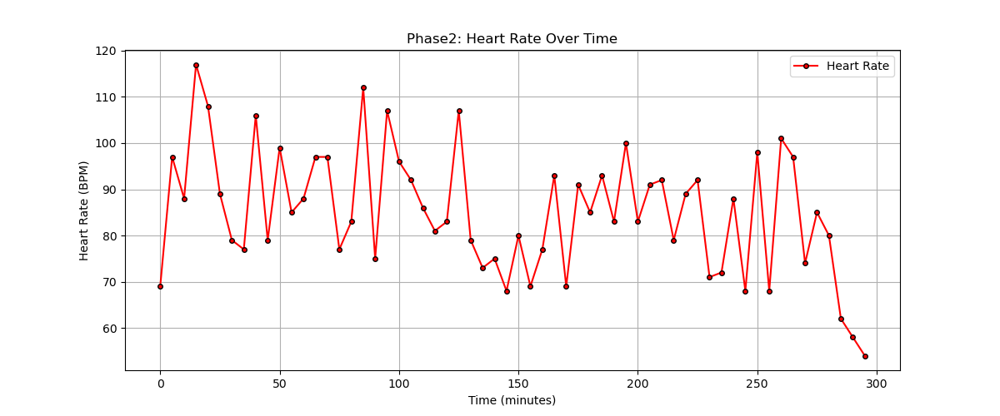
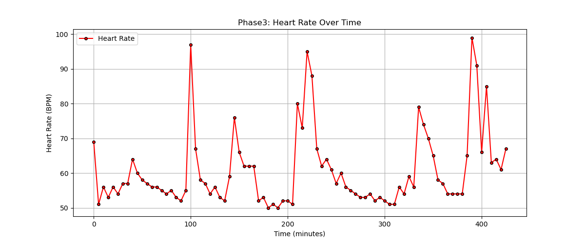

## Question 1

Take a look at the file labeled `data/phase0.txt`. Why might we have missing values or values that state "NO DATA" in this dataset? While we are currently ignoring these values, what might be the risk of filtering these values out?

### **Answer:**

There are only **two primary reasons** why we have issues with some values in the dataset:

1. **Technical Issues with the Device:**
   - **Signal or Data Transfer Errors:** The device may temporarily lose connection or encounter issues during data transfer, resulting in incomplete or missing records due to weak signals, software glitches, or corrupted data.  
   - **Battery Depletion (Less likely):** If the device’s battery dies, it will not record heart rate data, but this is probably not the case because the invalid data is sporadic rather than continuous.
2. **Participant Non-Compliance:**
   - **Improper Device Usage:** The participant may not wear the device correctly, causing recording errors.  
   - **Intentional Device Removal or Pausing:** Temporary removal or turning off the device can result in data gaps, particularly during activities where the device is uncomfortable or inconvenient to wear.

### **Risk of Filtering Out Invalid/Missing Entries:**

- **Data Quality and Interpretation:** Ignoring invalid data can lead to **biased or incomplete analysis**, especially if the missing values are not randomly distributed.
- **Patterns in Missing Data:** Analyzing when and why data is missing can reveal **valuable insights** about device functionality or user behavior.
- **Statistical Impact:** Filtering out too much data can **reduce the sample size**, potentially affecting the statistical power of the analysis and leading to less reliable conclusions.

## **Summary of Findings**  

| Phase   | Average Heart Rate (BPM) | Maximum Heart Rate (BPM) | Standard Deviation |
|---------|--------------------------|--------------------------|--------------------|
| Phase0  | 64.59                     | 93                       | 8.53               |
| Phase1  | 87.3                      | 110                      | 9.9                |
| Phase2  | 85.18                     | 117                      | 13.38              |
| Phase3  | 60.65                     | 99                       | 11.0               |

---

## Question 2

During sleep, we expect maximum heart rate of a phase to be **lower** than the maximum heart rate of all other phases. Observe the visualizations and descriptive statistics that you've calculated. Using these findings, in which phase does sleep occur? Mention numerical details that back your findings.

### **Answer:**

Based on the findings from the dataset, I believe that **Phase0** perfectly fits the **sleeping phase**.

1. **Low Average Heart Rate (64.59 BPM):**  
   - This value is within the normal range of a **resting heart rate** during sleep.  
   - Significantly lower than the other phases, suggesting a relaxed, resting state.  

2. **Low Maximum Heart Rate (93 BPM):**  
   - The lowest maximum heart rate among all phases, indicating minimal physical activity.  
   - During sleep, the heart rate rarely spikes unless disturbed by an external factor.  

3. **Low Standard Deviation (8.53):**  
   - A stable heart rate with minimal fluctuations is typical during sleep.  
   - Consistent and smooth heart rate readings align with restful sleep.  

4. **Visualization Analysis:**  
   - As we can see from the **Phase0 plot**, the heart rate is **higher at the beginning of the recording** and then **gradually decreases**, becoming **more stable and less variable** over time.  
   - This pattern suggests that the participant was likely **falling asleep**, transitioning from an active or awake state to a restful sleeping phase.  

#### **Plot: Phase0 (Sleep Phase)**

## Question 3

During exercise, we expect the maximum heart rate of a phase to be **higher** the maximum heart rate of all other phases. Observe the visualizations and descriptive statistics that you've calculated. Using these findings, in which phase(s) does exercise occur? Mention numerical details that back your findings.

### **Answer:**

Based on the findings, **Phase2** most likely corresponds to periods of exercise or intense physical activity, with **Phase1** potentially including some moderate exercise.  

1. **High Maximum Heart Rate (117 BPM in Phase2):**  
   - This is the highest maximum heart rate recorded, indicating intense physical activity.  
   - The heart rate spikes significantly in the visualization of **Phase2**.  

2. **Moderate Maximum Heart Rate (110 BPM in Phase1):**  
   - The second-highest maximum heart rate suggests possible moderate physical activity.  
   - Phase1 shows less dramatic spikes compared to Phase2, but still higher than resting levels.  

3. **Higher Standard Deviation (13.38 in Phase2):**  
   - A high standard deviation indicates greater variability in heart rate, which is typical during exercise.

#### **Plot: Phase1 (Moderate Exercise)**

#### **Plot: Phase2 (Intense Exercise)**

## Question 4

During regular periods of awake activity, we expect the average heart rate of a phase to be relatively **lower** than the average heart rate of other phases, but we also expect standard deviation to be **higher**. In which phase do we notice this trend?

### **Answer:**

Based on the findings, **Phase3** most likely corresponds to periods of **awake, non-exercise activity** such as walking, talking, or general light movement.

1. **Relatively Low Average Heart Rate (60.65 BPM):**  
   - The lowest average heart rate among all phases, except for the sleep phase (**Phase0**).  
   - Suggests a calm, but not fully resting state.  

2. **Higher Standard Deviation (11.0):**  
   - A higher standard deviation compared to the sleep phase (**Phase0**), but lower than the exercise phase (**Phase2**).  
   - Indicates variability in heart rate, which aligns with normal awake activity involving light to moderate movement.  

3. **Maximum Heart Rate (99 BPM):**  
   - The heart rate occasionally increases but not to the extent observed during exercise.  
   - Matches typical fluctuations expected during **daily activities**.  

4. **Visualization Analysis:**
   - The plot for **Phase3** shows a moderate level of fluctuation, with no extreme spikes like in the exercise phases (**Phase1 & Phase2**).  
   - The data suggests the participant was awake and likely engaging in low-intensity activities.  

#### **Plot: Phase3 (Awake Activity)**  

